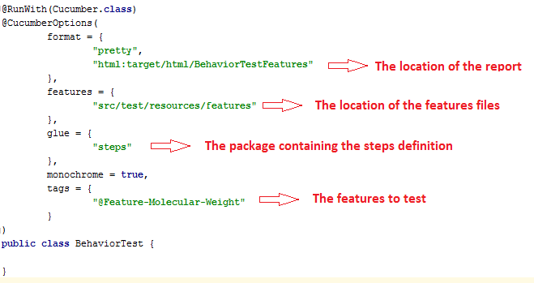
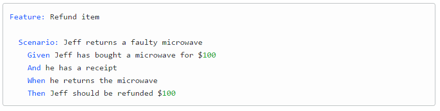
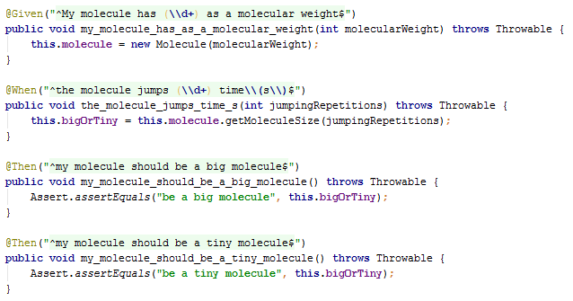
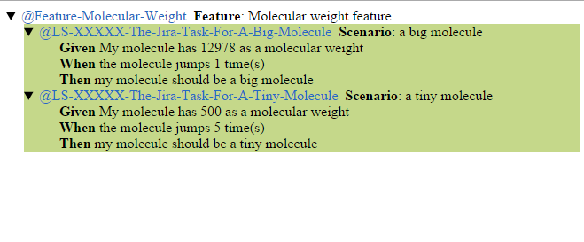

# Cucumber POC

## About Cucumber

Cucumber is a software tool for testing other software. It runs automated acceptance tests written in a behavior-driven development (BDD) style. 
It is written in the Ruby programming language but it has implementation for a lot of languages, including Java. Cucumber allows the 
execution of feature documentation written in business-facing text.

For more information:

[Cucumber official web page](https://cucumber.io/)

## The three steps to get started

You need at least three steps to start working with cucumber:

* The behavior definition
* The feature definition
* The steps definition

### Behavior

You need to define a behavior class (Which name has to end with "Test") where you can define the report location, the features files location, the step definition location and which features you want to test. You can configure a lot of things here, take a look at the Cucumber documentation for more details.

### Features: Gherkin language
Cucumber executes your .feature files, and those files contain executable specifications written in a language called Gherkin.

Gherkin is plain-text English (or one of 60+ other languages) with a little extra structure. Gherkin is designed to be easy to learn by non-programmers, yet structured enough to allow concise description of examples to illustrate business rules in most real-world domains.

Here is a sample Gherkin document:

In Gherkin, each line that isn't blank has to start with a Gherkin keyword, followed by any text you like.

### Steps

Once defined the feature, you have to implement the concrete steps to execute for each feature. If you skip that step, you can use maven snippets as an skeleton of your steps definition. Just compile the code and look at the maven outcome on console. It contains suggestions of how the steps should be.

Here is where you will be doing the asserts and checking the code.

## Use Maven to execute the test

On the parent folder of the project type:

`mvn clean compile`
    
## Look at the report
    
You can check the cucumber html report on the path:

`${PARENT_FOLDER}/cucumber-poc-acceptance/target/html/index.html`

It has to look something like this:

